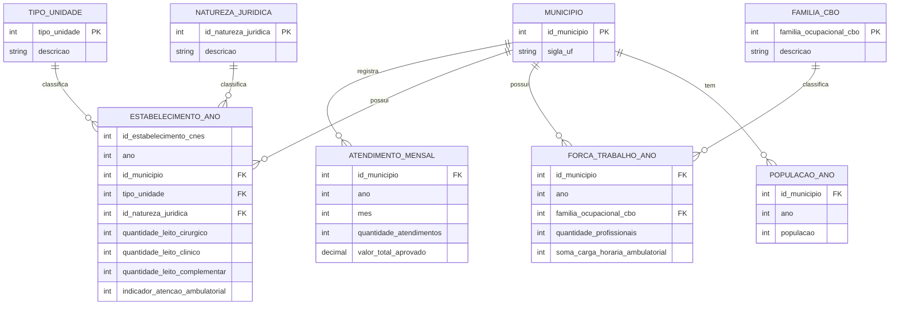
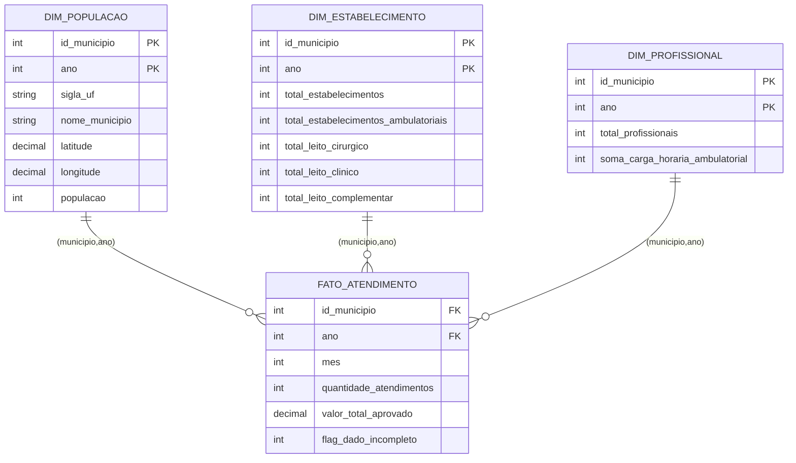

# VERTEX — Modelagem de Dados (Conceitual → Lógico → Dimensional)

Escopo: Estado de São Paulo, 645 municípios, 2021–2024. Fontes: SIASUS (produção ambulatorial), CNES-ST (estabelecimentos), CNES-PF (profissionais, agregado), IBGE (população).

---

## 1. Diagnóstico dos dados recebidos

Antes de modelar, perfilei os 4 CSVs. Isso muda decisões de design, então vai primeiro.

| Base | Linhas | Grão real | Período | Cobertura de municípios | Achados/riscos |
|---|---|---|---|---|---|
| `siasus_atendimentos_sp.csv` | 28.909 | município × ano × mês | jan/2021–dez/2024 | **642 de 645** aparecem ao menos uma vez; por mês, só 497–640 municípios têm linha | (a) **3 municípios nunca aparecem** (3523305, 3545100, 3554656) — zero produção registrada nos 4 anos; (b) **mês 3/2024 está totalmente ausente** — nenhuma linha, para nenhum município (parece falha/atraso de consolidação da competência, não um "zero real"); (c) ausência de linha ≠ zero: DataSUS só grava quando há produção, então um município sem linha num mês pode ser zero de verdade ou dado não chegou — precisa de regra explícita. |
| `ibge_populacao_sp.csv` | 2.580 | município × ano | 2021–2024 | **645/645**, sem duplicatas, sem buracos | Base mais limpa das quatro. Não tem nome do município nem lat/long — só o código IBGE. |
| `cnes_estabelecimento_sp.csv` | 331.052 | estabelecimento × ano (snapshot) | **jan/2021, jan/2022, jan/2023, jan/2024** | 645/645 | Você descreveu como "2 fotografias (jan do 1º ano e dez do 4º ano)" — **não é isso**: são **4 fotografias, uma por ano, sempre em janeiro**. Vale corrigir a documentação da sprint. Isso é bom (dá 4 pontos no tempo em vez de 2), mas ainda é snapshot anual, não histórico contínuo. Entre 2021 e 2024: 68.871 estabelecimentos permanecem, 22.208 são novos, 5.134 saem — há bastante dinâmica (abertura/fechamento) que a modelagem precisa suportar. `tipo_unidade` (38 valores) e `id_natureza_juridica` (40 valores) são só códigos — sem descrição no arquivo. `indicador_atencao_ambulatorial` é uma flag independente (não é 100% derivável do tipo de unidade). |
| `cnes_profissional_sp_agg.csv` | 94.088 | município × ano × família CBO (**já agregado**) | 2021–2024 | 645/645 | Já vem agregado — **não há mais o estabelecimento nem o profissional individual**, só a soma por município/ano/ocupação. 775 linhas (0,8%) têm `familia_ocupacional_cbo` nulo (provável "não classificado"). |

**Implicação central para a modelagem:** as quatro bases têm **grãos de tempo diferentes** — SIASUS é mensal, as outras três são anuais. Isso é a decisão de design mais importante do projeto inteiro (ver seção 4).

---

## 2. Decisões assumidas nesta modelagem

Marquei como suposições para você confirmar/ajustar:

1. **Linha ausente no SIASUS vira zero, mas com uma flag `flag_dado_incompleto`** que distingue "zero real" de "buraco de coleta" (não dá pra simplesmente sumir com a linha, senão o `NULLIF`/divisão da view quebra ou mente). A flag é calculada automaticamente em dois casos — ver seção 7.3.
2. **Snapshot anual do CNES (jan) representa a capacidade do município durante todo aquele ano** — no modelo simplificado isso é resolvido pela própria chave (`id_municipio`, `ano`) das dimensões, sem precisar de forward-fill manual (ver seção 5).
3. **CBO nulo vira categoria "Não classificado"** em vez de ser descartado — descartar subestimaria a força de trabalho.
4. Os 3 municípios sem nenhum registro no SIASUS **não** entram como "zero real" silencioso — entram com `flag_dado_incompleto = 1` em todos os 48 meses, porque checando o CNES deles a hipótese de abandono total não se sustenta (ver seção 7.3).

---

## 3. Modelo conceitual (Entidade-Relacionamento)



Observação: `TIPO_UNIDADE`, `NATUREZA_JURIDICA` e `FAMILIA_CBO` viram entidades próprias em vez de atributos soltos porque os códigos se repetem para muitos estabelecimentos/profissionais — sem isolar a descrição, ela ficaria redundante em centenas de milhares de linhas (e você não tem as descrições nos arquivos atuais — precisa importar as tabelas de domínio oficiais do CNES/CBO para popular essas três dimensões).

---

## 4. Modelo lógico normalizado (3FN)

| Tabela | Chave primária | Chaves estrangeiras | Observação de normalização |
|---|---|---|---|
| `MUNICIPIO` | `id_municipio` | — | Nome/lat-long ainda não existem nas suas bases — precisa enriquecer com a malha municipal do IBGE antes do heatmap. |
| `TIPO_UNIDADE` | `tipo_unidade` | — | Domínio a popular com a tabela oficial de tipos de unidade do CNES. |
| `NATUREZA_JURIDICA` | `id_natureza_juridica` | — | Domínio a popular com a tabela CONCLA/Receita de natureza jurídica. |
| `FAMILIA_CBO` | `familia_ocupacional_cbo` | — | Inclua a linha sentinela (ex. `-1`, "Não classificado") para cobrir os nulos. |
| `ATENDIMENTO_MENSAL` | (`id_municipio`,`ano`,`mes`) | `id_municipio` → MUNICIPIO | Grão mensal, direto do SIASUS. |
| `ESTABELECIMENTO_ANO` | (`id_estabelecimento_cnes`,`ano`) | `id_municipio`, `tipo_unidade`, `id_natureza_juridica` | Grão anual (snapshot de janeiro). |
| `FORCA_TRABALHO_ANO` | (`id_municipio`,`ano`,`familia_ocupacional_cbo`) | `id_municipio`, `familia_ocupacional_cbo` | Já vem agregado — não dá pra descer a estabelecimento/profissional individual. |
| `POPULACAO_ANO` | (`id_municipio`,`ano`) | `id_municipio` | Grão anual, sem problemas de qualidade. |

Está em 3FN porque toda coluna não-chave depende da chave inteira e nada além dela — as descrições de `tipo_unidade`, `id_natureza_juridica` e `familia_ocupacional_cbo` foram isoladas justamente para eliminar a dependência transitiva que existiria se ficassem coladas em `ESTABELECIMENTO_ANO`/`FORCA_TRABALHO_ANO`.

**Dependências funcionais (por tabela), para justificar cada forma normal:**

- `MUNICIPIO`: `id_municipio → sigla_uf, nome_municipio`. Chave simples, sem dependência parcial nem transitiva possível → trivialmente 3FN.
- `TIPO_UNIDADE`: `tipo_unidade → descricao`. Idem.
- `NATUREZA_JURIDICA`: `id_natureza_juridica → descricao`. Idem.
- `FAMILIA_CBO`: `familia_ocupacional_cbo → descricao`. Idem.
- `ATENDIMENTO_MENSAL`: `(id_municipio, ano, mes) → quantidade_atendimentos, valor_total_aprovado`. Chave composta, mas os atributos dependem das 3 partes juntas (não dá pra saber quantidade só por município, ou só por mês) → sem dependência parcial → 2FN. Sem dependência transitiva (não há atributo não-chave determinando outro) → 3FN.
- `ESTABELECIMENTO_ANO`: `(id_estabelecimento_cnes, ano) → id_municipio, tipo_unidade, id_natureza_juridica, leitos, indicador_atencao_ambulatorial`. Aqui é onde a normalização importa de verdade: se a **descrição** de `tipo_unidade` estivesse nesta tabela (em vez de só o código), teríamos `tipo_unidade → descricao_tipo_unidade` como dependência transitiva (a descrição depende do código, que não é chave) — violaria 3FN. Isolar em `TIPO_UNIDADE` (e o mesmo para `NATUREZA_JURIDICA`) resolve isso.
- `FORCA_TRABALHO_ANO`: `(id_municipio, ano, familia_ocupacional_cbo) → quantidade_profissionais, soma_carga_horaria_ambulatorial`. Mesma lógica — se a descrição do CBO estivesse aqui, seria dependência transitiva via `familia_ocupacional_cbo`.
- `POPULACAO_ANO`: `(id_municipio, ano) → populacao`. Trivial.

---

## 5. Modelo dimensional (star schema simplificado — 4 tabelas)

Versão enxuta, conforme decidido: `DIM_POPULACAO`, `DIM_ESTABELECIMENTO`, `DIM_PROFISSIONAL` e `FATO_ATENDIMENTO`. O truque para resolver o descasamento de grão (SIASUS mensal × CNES/IBGE anual) sem precisar de uma quinta tabela: as três dimensões têm grão **município × ano** (não só município — a capacidade muda todo ano), e o fato referencia cada uma delas por `(id_municipio, ano)`. Os 12 meses de um mesmo ano simplesmente reaproveitam a mesma linha de dimensão — é o forward-fill acontecendo pela própria chave estrangeira, sem precisar duplicar dado ou criar uma tabela de fato anual à parte.



Duas decisões de grão que valem registrar (já aplicadas nos scripts):

- **`DIM_ESTABELECIMENTO` e `DIM_PROFISSIONAL` ficaram agregadas a totais por município-ano**, sem quebra por tipo de unidade/natureza jurídica/família CBO. Isso é necessário porque `FATO_ATENDIMENTO` (SIASUS) não tem granularidade de estabelecimento nem de ocupação — se `DIM_PROFISSIONAL` mantivesse uma linha por CBO, qualquer relatório que juntasse as duas tabelas agrupando por CBO inflaria `quantidade_atendimentos` (o valor do fato se repetiria uma vez por CBO daquele município — um *fan-out* clássico). Perde-se o detalhe fino (quantos médicos vs. enfermeiros, por exemplo), mas evita esse bug de contagem.
- **Nome do município, latitude e longitude ficaram embutidos em `DIM_POPULACAO`** (em vez de uma tabela `DIM_MUNICIPIO` separada), já que população é 1:1 por município-ano de qualquer forma — isso não duplica dado nem quebra as 4 tabelas, mas ainda precisa ser **enriquecido**: nenhuma das bases enviadas traz nome ou coordenadas, só o código IBGE.

O índice VERTEX não virou uma 5ª tabela física — é uma **view** (`vw_indice_vertex`, no script SQL) que junta as 4 tabelas em tempo de consulta e calcula APC/PPC/EPC e o índice de subutilização. Só materializar como tabela de fato se a performance do dashboard exigir.

---

## 6. Hipótese para a fórmula do índice (APC / PPC / EPC)

No material da Sprint 2 aparecem os indicadores **APC, PPC e EPC** sem definição escrita em nenhum slide. Pelos dados que vocês coletaram, a leitura mais provável é:

- **APC — Atendimentos Per Capita** = `quantidade_atendimentos / populacao`
- **PPC — Profissionais Per Capita** = `total_profissionais / populacao`
- **EPC — Estabelecimentos Per Capita** = `total_estabelecimentos_ambulatoriais / populacao`

E o índice de subutilização seria algo como:

```
indice_subutilizacao = APC / (peso_p * PPC + peso_e * EPC)
```

ou seja, atendimento per capita dividido pela capacidade instalada per capita (profissionais + estabelecimentos, ponderados). Município com índice baixo = atende pouco para a capacidade que tem → candidato a subutilização/abandono indireto. **Isso é uma hipótese minha para destravar a modelagem — confirmem com o que já foi discutido em sala/com a Scrum Master antes de tratar como definitivo**, principalmente os pesos `peso_p` e `peso_e`, que hoje não têm base definida (dá pra começar com 0,5/0,5 e calibrar depois olhando a distribuição real).

---

## 7.5. Preparando o schema para o Oracle Select AI (chatbot)

O pitch original prevê um "chatbot de consulta" — o `vertex_scripts_ddl.sql` agora já deixa isso pronto pro **Oracle Select AI** (o recurso de linguagem natural → SQL do Autonomous Database), em dois blocos novos:

- **Bloco 5 — `COMMENT ON`**: documenta em texto simples cada tabela e coluna das 4 tabelas + a view do índice. Isso importa porque o Select AI usa esses comentários (junto com os nomes) pra entender o que cada coluna significa antes de gerar o SQL — sem comentário, uma pergunta como "quais municípios têm maior abandono?" tem muito mais chance do modelo escolher a coluna errada ou ignorar a flag de dado incompleto.
- **Bloco 6 — criação do profile**: cria e ativa um profile do Select AI (`VERTEX_PROFILE`) escopado **só** nas 4 tabelas analíticas + a view (`DIM_POPULACAO`, `DIM_ESTABELECIMENTO`, `DIM_PROFISSIONAL`, `FATO_ATENDIMENTO`, `VW_INDICE_VERTEX`) — de propósito, as tabelas do 3FN (staging interno) ficam de fora, porque não têm nome/comentário amigável pra pergunta em linguagem natural e não deveriam ser expostas ao usuário final do chatbot.

Pré-requisito que fica de fora deste script (é configuração do seu tenancy OCI, não do banco): uma credencial de IA generativa criada via `DBMS_CLOUD.CREATE_CREDENTIAL`, apontada pelo nome `OCI_GENAI_CRED` no Bloco 6 — troquem pelo nome real da credencial de vocês quando forem configurar isso na infraestrutura OCI.

---

## 8. Lista de melhorias e riscos para decidir

1. **Falta tabela de nomes de município** (e idealmente lat/long) — sem isso não dá pra fazer o heatmap prometido no pitch. Precisa importar a malha municipal do IBGE.
2. **Faltam as tabelas de domínio** (descrição de `tipo_unidade`, `id_natureza_juridica`, `familia_ocupacional_cbo`) — sem elas os filtros do dashboard ("por especialidade", por tipo de unidade) ficam só com código numérico, ilegível pro gestor público.
3. **[CONFIRMADO] Mês 3/2024 ausente por completo** — verificado direto no BigQuery: `basedosdados.br_ms_sia.producao_ambulatorial` tem março/2024 para **todos os outros 25 estados** do Brasil, exceto **SP e Tocantins**. O dado existe de verdade no DataSUS original (confirmado no TABNET: `PASP2403a/b/c.dbc` publicados), só não chegou nesse espelho específico do Base dos Dados. Não é falha do pipeline da equipe. O `fato_atendimento` detecta isso automaticamente (qualquer competência com zero linhas no estado inteiro vira `flag_dado_incompleto = 1`) e a `vw_indice_vertex` devolve `NULL` (não zero) pro índice nesse mês, em vez de aparecer como "abandono total" no dashboard.
4. **[CONFIRMADO] 3 municípios sem produção no SIASUS a partir de 2021 (3523305, 3545100, 3554656)** — investigação completa: (a) todos os três têm rede de saúde funcionando segundo o CNES (de 3 a 12 estabelecimentos ambulatoriais e de 40 a 238 profissionais, dependendo do ano); (b) uma consulta na tabela `producao_ambulatorial` **sem filtro de UF/ano** mostrou que os três **têm histórico normal até 2019** e somem exatamente a partir de 2020 — coincidindo com a janela em que municípios pequenos migraram o registro da atenção básica para o **e-SUS APS/SISAB**, sistema que essa tabela do SIA-PA clássico não captura. Não é abandono real nem falha de coleta: é mudança de sistema de origem, bem documentada e esperada para municípios desse porte (população entre 2 mil e 17 mil habitantes — 0,05% da população do estado). Tratado como `flag_dado_incompleto = 1` (índice sai `NULL`, nunca "zero/abandono total" falso). Vira uma nota de limitação no relatório final, não uma pendência técnica.
5. **CNES-PF já vem agregado por família CBO** — perderam a granularidade de estabelecimento e de profissional individual. Isso é uma limitação a declarar explicitamente na metodologia (não dá pra saber, por exemplo, se os profissionais estão concentrados em poucos estabelecimentos ou distribuídos).
6. **Churn de estabelecimentos (22.208 novos, 5.134 saíram entre 2021 e 2024)** é, na real, um dado interessante por si só — abertura/fechamento de unidade de saúde pode ser incorporado como uma variável adicional do índice (não só quantidade, mas estabilidade da rede).
7. **A fórmula do índice (seção 6) segue sem validação formal** — o backlog da Sprint 2 já sinalizava isso como pendente; com escopo reduzido a SP agora é totalmente viável validar antes da entrega final, testando em municípios que vocês conhecem o contexto (ex.: comparar capital vs. interior).
